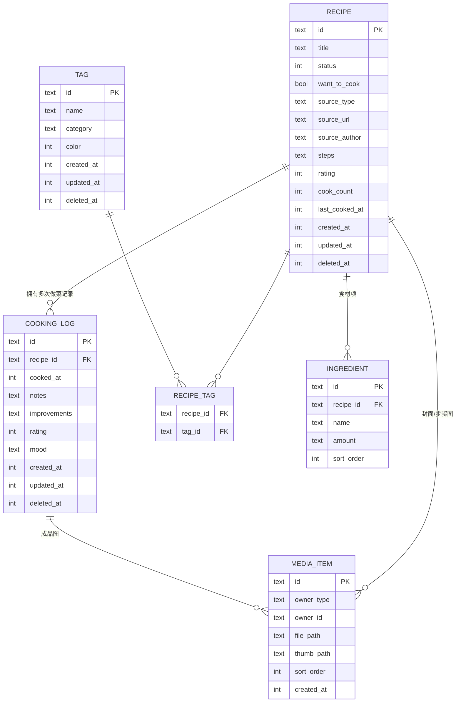

# 03 · 数据模型设计

## 1. 实体关系（ER）



**核心关系说明**：
- 一个 `Recipe`（菜谱卡）可拥有多条 `CookingLog`（做菜记录）→ 这道菜的「进化时间线」。
- `CookingLog.recipe_id` 可为空（允许「随手记一笔，暂不归类」）。
- `Tag` 与 `Recipe` 多对多。
- `MediaItem` 通过 `owner_type`(`recipe`/`cooking_log`) + `owner_id` 多态关联图片。

## 2. 表结构定义

> 时间字段统一存 Unix 毫秒时间戳（int）。所有主键为 UUID v4 字符串。所有业务表含 `created_at / updated_at / deleted_at`（软删除）。

### 2.1 recipes（菜谱）

| 字段 | 类型 | 约束/说明 |
| --- | --- | --- |
| id | TEXT | PK, UUID |
| title | TEXT | NOT NULL，菜名 |
| status | INTEGER | 枚举：0=想做, 1=已做, 2=常做, 3=搁置 |
| want_to_cook | INTEGER(bool) | 是否在想做清单（冗余便于筛选） |
| source_type | TEXT | 枚举：none/link/video/image/book/origin(原创) |
| source_url | TEXT | 来源链接（可空） |
| source_author | TEXT | 来源博主/作者（可空） |
| steps | TEXT | 步骤（Markdown/纯文本，可空，v1 可简单存文本） |
| description | TEXT | 简介/一句话（可空） |
| cover_media_id | TEXT | 封面图 media id（可空） |
| rating | INTEGER | 综合评分 0-5（可空） |
| cook_count | INTEGER | 做过次数（由 CookingLog 派生维护） |
| last_cooked_at | INTEGER | 最近一次做的时间 |
| created_at | INTEGER | |
| updated_at | INTEGER | |
| deleted_at | INTEGER | 软删除，NULL=未删 |

索引：`idx_recipes_status`、`idx_recipes_updated_at`、`idx_recipes_deleted_at`。

### 2.2 cooking_logs（做菜记录）

| 字段 | 类型 | 说明 |
| --- | --- | --- |
| id | TEXT | PK, UUID |
| recipe_id | TEXT | FK→recipes.id，可空 |
| cooked_at | INTEGER | 做菜日期/时间 |
| notes | TEXT | 心得（咸淡、火候、用时、感受） |
| improvements | TEXT | 对原菜谱的改良 |
| rating | INTEGER | 本次评分 0-5 |
| mood | TEXT | 心情/标记（可空，emoji 或短文本） |
| created_at | INTEGER | |
| updated_at | INTEGER | |
| deleted_at | INTEGER | |

索引：`idx_logs_recipe_id`、`idx_logs_cooked_at`、`idx_logs_updated_at`。

### 2.3 tags（标签）

| 字段 | 类型 | 说明 |
| --- | --- | --- |
| id | TEXT | PK, UUID |
| name | TEXT | 标签名，唯一（同 category 内） |
| category | TEXT | 分类：cuisine(菜系)/taste(口味)/scene(场景)/ingredient(主料)/custom |
| color | INTEGER | 颜色值（可空） |
| created_at / updated_at / deleted_at | INTEGER | |

预置标签（首次启动写入）：
- 菜系：川菜、粤菜、家常、西餐、日料…
- 口味：麻辣、清淡、酸甜、香辣…
- 场景：快手菜、宴客、早餐、下饭、汤羹…

### 2.4 recipe_tags（菜谱-标签关联）

| 字段 | 类型 | 说明 |
| --- | --- | --- |
| recipe_id | TEXT | FK |
| tag_id | TEXT | FK |

主键：(recipe_id, tag_id)。索引：两列各建索引。

### 2.5 ingredients（食材项，可选拆表）

| 字段 | 类型 | 说明 |
| --- | --- | --- |
| id | TEXT | PK |
| recipe_id | TEXT | FK |
| name | TEXT | 食材名 |
| amount | TEXT | 用量（自由文本，如「2 勺」「适量」） |
| sort_order | INTEGER | 排序 |

> v1 简化方案：食材也可直接以 JSON 文本存在 `recipes` 的一个字段里，减少表数量；若需要按食材搜索/统计，则用本独立表。**推荐独立表**以支持「按食材找菜」。

### 2.6 media_items（图片）

| 字段 | 类型 | 说明 |
| --- | --- | --- |
| id | TEXT | PK, UUID |
| owner_type | TEXT | recipe / cooking_log |
| owner_id | TEXT | 所属实体 id |
| file_path | TEXT | 相对路径，如 `media/2026/06/<uuid>.jpg` |
| thumb_path | TEXT | 缩略图相对路径（可空） |
| width / height | INTEGER | 可空 |
| sort_order | INTEGER | 顺序 |
| created_at | INTEGER | |

索引：`idx_media_owner`(owner_type, owner_id)。

### 2.7 app_meta（应用元数据，键值）

| key | 示例值 | 说明 |
| --- | --- | --- |
| schema_version | 1 | 数据库版本，用于迁移与备份兼容 |
| install_id | uuid | 本安装实例标识（未来同步/备份溯源） |
| last_backup_at | 时间戳 | 最近备份时间 |
| update_check_enabled | true | 是否自动检查更新 |

## 3. 派生数据维护

- `recipes.cook_count` / `last_cooked_at`：在新增/删除 `cooking_log` 时由 Repository 更新（或用触发器）。
- 首条 `cooking_log` 写入时：若 `recipe.status==想做` → 置为「已做」，`want_to_cook=false`。
- `cook_count >= 3`：提示用户是否标记「常做」（不自动改，给用户选择）。

## 4. 数据库迁移策略（Drift）

- 用 `schemaVersion` 管理；每次表结构变更 +1，在 `MigrationStrategy.onUpgrade` 写迁移脚本。
- 备份文件 `manifest.json` 记录导出时的 `schema_version`；导入时若低于当前版本，先按内置迁移逻辑升级数据再入库（见 05 文档）。
- 建议保留每个版本的建表 SQL 快照（drift 可生成 schema 文件），便于编写与测试迁移。

## 5. JSON 序列化（备份/未来同步通用）

每个实体都实现 `toJson() / fromJson()`，备份导出即「全表 dump 成 JSON + 媒体文件」。示例（Recipe）：

```json
{
  "id": "f6c1...uuid",
  "title": "番茄炒蛋",
  "status": 1,
  "want_to_cook": false,
  "source_type": "video",
  "source_url": "https://...",
  "source_author": "@某美食博主",
  "steps": "1. 打蛋...\n2. 炒...",
  "description": "百搭快手菜",
  "cover_media_id": "m-abc...",
  "rating": 5,
  "cook_count": 4,
  "last_cooked_at": 1750000000000,
  "tags": ["t-cuisine-home", "t-scene-fast"],
  "ingredients": [{"name":"鸡蛋","amount":"3 个","sort_order":0}],
  "created_at": 1740000000000,
  "updated_at": 1751000000000,
  "deleted_at": null
}
```

> 统一的 JSON 序列化是「导出/导入」与「未来网盘同步」共用的基础，二者复用同一套 `(De)Serializer`。
