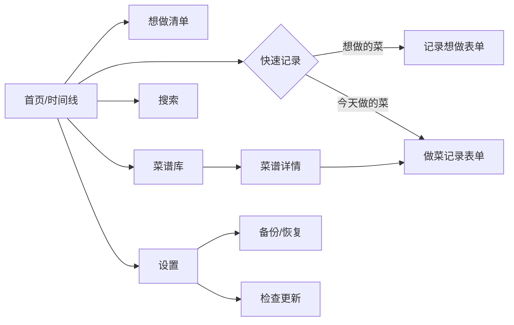
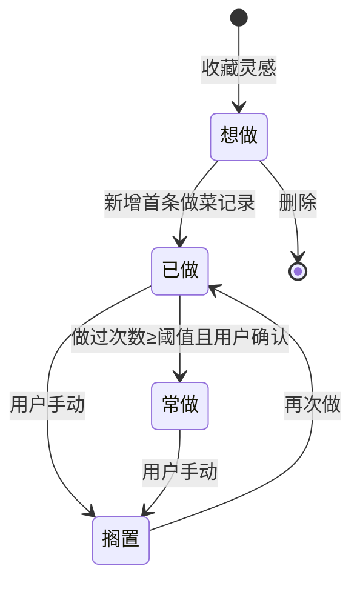

# 04 · 功能模块详细设计

## 模块总览

---

## 1. 快速记录「想做的菜」(F-01)

**目标**：≤15 秒、最少必填完成收藏。

**入口**：首页 FAB → 「想做的菜」。

**表单字段**：
- 菜名（必填，唯一必填项）
- 来源：链接 / 博主 / 来源类型（可只粘贴一个链接）
- 封面图（可拍照/相册/截图，可空）
- 标签（可选，常用标签快捷选择）
- 备注（可空）

**交互要点**：
- 进入即聚焦菜名输入框，键盘弹出。
- 「粘贴链接」按钮一键读取剪贴板填入 source_url；P2 阶段可抓取标题/封面。
- 保存即创建 `Recipe`：`status=想做, want_to_cook=true`。
- 保存后回到清单并高亮新条目，给「再记一条」快捷按钮。

---

## 2. 快速记录「今天做的菜」(F-02)

**入口**：①首页 FAB →「今天做的菜」；②菜谱详情页「+ 记录这次」。

**两种起点**：
- 从已有菜谱进入：自动带入 `recipe_id`，只需填本次心得/图/评分。
- 从 FAB 全新进入：先选/搜已有菜谱，或「新建菜谱」（输入菜名即可）。

**表单字段**：
- 关联菜谱（从详情进入则已带入）
- 成品照片（可多张）
- 心得 notes（咸淡/火候/用时/感受）
- 改良 improvements（这次改了什么）
- 本次评分 rating
- 做菜日期 cooked_at（默认今天）

**保存逻辑**：
- 创建 `CookingLog`。
- 维护所属 `Recipe`：`cook_count++`，`last_cooked_at=cooked_at`；若原状态为「想做」→ 改为「已做」、`want_to_cook=false`。
- 若 `cook_count` 达阈值，弹「要不要标记为常做？」。

---

## 3. 想做清单 (F-04)

- 仅展示 `want_to_cook=true`（或 `status=想做`）的菜谱卡。
- 卡片显示：封面、菜名、来源博主、标签、收藏时间。
- 支持筛选：标签、食材、来源类型；排序：最近添加/随机「今天做这个吧」。
- 卡片操作：去做（→做菜记录）、编辑、删除、查看来源链接。
- 空态引导：「刷到好菜谱？点 + 存下来，周末就有的做啦」。

---

## 4. 菜谱库 (F-03) 与 菜谱详情 (F-05)

### 菜谱库
- 网格/列表展示所有未删除菜谱（可按状态分段：常做 / 已做 / 想做）。
- 顶部筛选条：状态、标签、菜系；搜索框。
- 卡片：封面、菜名、评分、做过次数、最近做的时间。

### 菜谱详情（核心页）
信息分区：
1. **头部**：封面、菜名、状态、评分、标签、来源（可点开链接）。
2. **菜谱主体**：食材清单、步骤、简介。
3. **我的改良汇总**：聚合历次 `cooking_log.improvements`（按时间倒序），让用户一眼看到最新改良版。
4. **做菜时间线**：历次 `CookingLog`（日期、图、心得、评分），即「这道菜的进化史」。
5. **操作**：+ 记录这次、编辑菜谱、分享(P2)、删除。

---

## 5. 标签系统 (F-06)

- 标签分类：菜系/口味/场景/主料/自定义。
- 新建记录时可即时创建标签；标签管理页可重命名、改色、合并、删除。
- 按标签筛选贯穿想做清单、菜谱库、搜索。

---

## 6. 图片管理 (F-07)

- 选图（拍照/相册）→ 压缩（长边≤1600, q≈80）→ 落盘 `media/yyyy/MM/<uuid>.jpg` → 生成缩略图 → 写 `media_items`。
- 列表用缩略图，详情点开看大图（支持多图横滑、缩放）。
- 删除记录时，关联图片随之物理删除（软删期内保留，回收站清空时删文件）。

---

## 7. 搜索与筛选 (F-08)

- 单一搜索框：匹配 菜名 / 心得 / 改良 / 食材 / 标签名。
- v1：SQLite `LIKE` 多字段匹配 + 标签/状态筛选器；结果分「菜谱」「做菜记录」两组。
- P1：升级 FTS5 + 中文分词，提升中文搜索体验。
- 支持「最近搜索」「常用筛选」快捷入口。

---

## 8. 首页/时间线 (F-12)

- 顶部问候 + 「今天做点什么」（从想做清单随机/推荐一道）。
- 主体：最近做菜记录时间线（图 + 菜名 + 心得摘要 + 日期）。
- 醒目 FAB（双动作：想做 / 今天做的）。
- 顶部入口：搜索、设置。
- 若长时间未备份，顶部出现轻提示条「上次备份在 X 天前，建议导出备份」。

---

## 9. 设置 (F-09~F-14, F-11)

- **数据备份与恢复**：导出备份、导入备份、查看上次备份时间、自动本地备份开关（详见 05 文档）。
- **检查更新**：当前版本号、手动检查、自动检查开关（详见 06 文档）。
- **标签管理**、**回收站**（软删除恢复/彻底删除）。
- **关于**：版本、开源依赖、隐私说明（数据仅存本地）。

---

## 10. 回收站（软删除）

- 删除任何实体 → `deleted_at=now`，进回收站。
- 回收站可恢复或彻底删除；保留 30 天后自动清理（清理时删除关联图片文件）。
- 备份默认不含已彻底删除的数据；软删除项可选是否纳入（用于跨端同步删除传播）。

---

## 11. 关键状态机：菜谱状态

