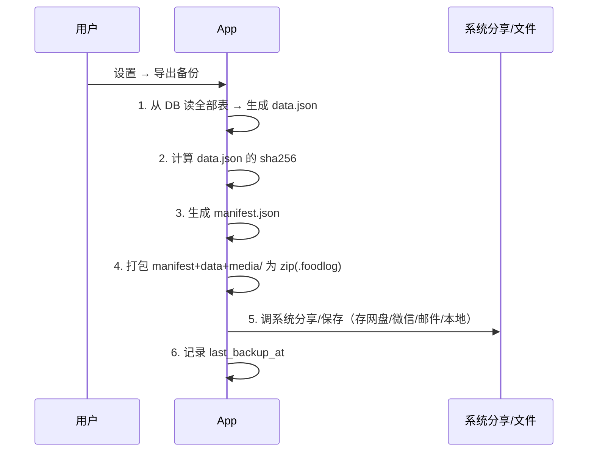
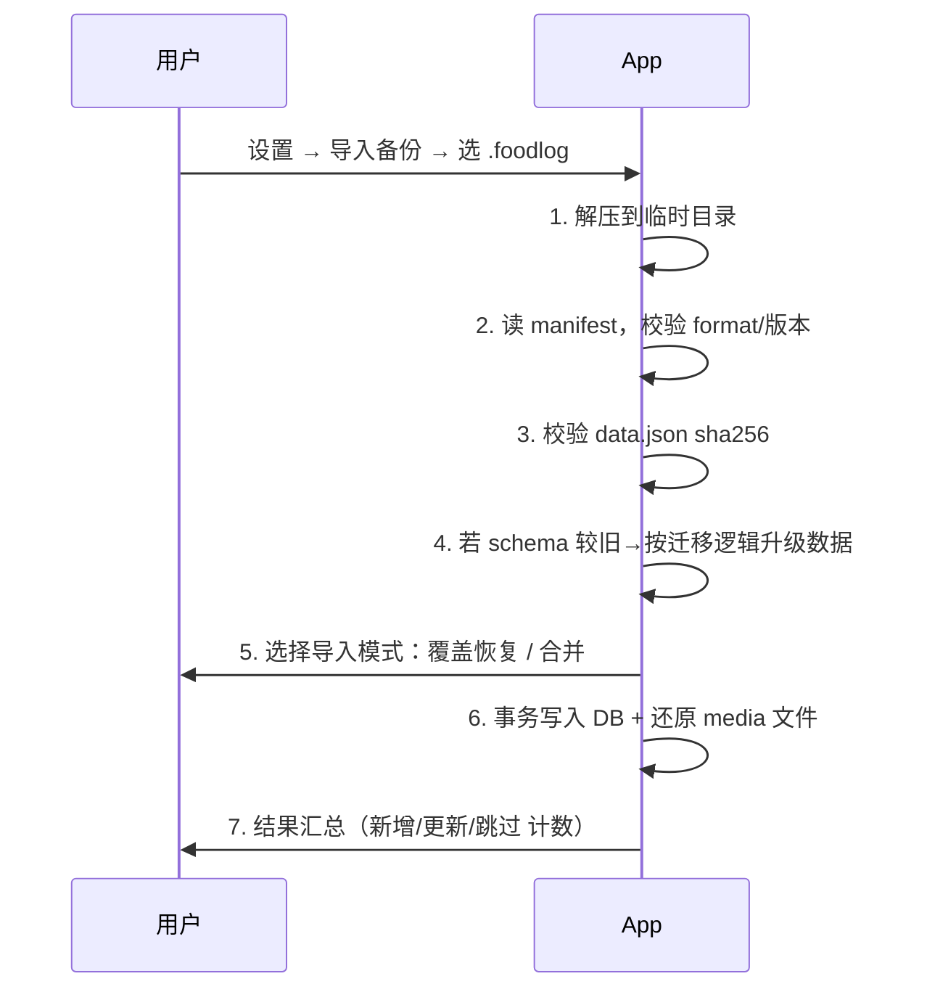

# 05 · 数据备份与迁移方案

> 这是「不做账号系统但换手机不丢数据」的核心方案。
> **v1 主方案：手动导出 / 导入备份文件**；架构同时为未来「网盘自动同步」打好基础。

## 1. 设计目标

| 目标 | 说明 |
| --- | --- |
| 零依赖 | 不需要服务器、不需要登录，一个文件搞定换机迁移 |
| 完整 | 备份包含全部结构化数据 + 所有图片 |
| 可靠 | 有版本号与校验，导入前校验完整性，失败不破坏现有数据 |
| 可合并 | 支持「覆盖恢复」和「合并」两种导入模式 |
| 前向兼容 | 同一套序列化逻辑未来可直接用于 WebDAV 自动同步 |

## 2. 备份文件格式：`.foodlog`

本质是一个 **zip 压缩包**，扩展名定制为 `.foodlog`（便于识别与关联打开）。

```
my-foodlog-backup-20260626-2130.foodlog   (zip)
├── manifest.json        # 元信息 + 校验
├── data.json            # 全量结构化数据（所有表 dump）
└── media/               # 全部图片，保持相对路径
    └── 2026/06/<uuid>.jpg ...
```

### manifest.json

```json
{
  "format": "foodlog-backup",
  "format_version": 1,
  "schema_version": 1,
  "app_version": "1.0.0",
  "app_version_code": 1,
  "install_id": "uuid-of-source-device",
  "exported_at": 1750000000000,
  "counts": { "recipes": 42, "cooking_logs": 130, "tags": 18, "media": 210 },
  "data_sha256": "<sha256 of data.json>",
  "media_count": 210,
  "encrypted": false
}
```

### data.json（结构）

```json
{
  "recipes":      [ { ...Recipe }, ... ],
  "cooking_logs": [ { ...CookingLog }, ... ],
  "tags":         [ { ...Tag }, ... ],
  "recipe_tags":  [ { "recipe_id": "...", "tag_id": "..." }, ... ],
  "ingredients":  [ { ...Ingredient }, ... ],
  "media_items":  [ { ...MediaItem }, ... ],
  "app_meta":     [ { "key": "...", "value": "..." }, ... ]
}
```

> 复用 03 文档定义的实体 `toJson()`。`media_items.file_path` 为相对路径，与 zip 内 `media/` 一一对应。

## 3. 导出流程



要点：
- 大文件用流式写入临时目录，避免内存溢出。
- 导出图片直接拷贝已压缩的本地文件，不二次压缩。
- 进度提示（条数/打包进度）。
- 默认文件名带时间戳；引导用户「存到你常用的网盘/微信文件传输助手」。

## 4. 导入流程



### 两种导入模式

**A. 覆盖恢复（Replace）— 换新手机首选**
- 清空当前数据（先自动备份当前为安全网）→ 全量写入备份内容。
- 适用：新手机第一次导入、或想完全回到某个备份点。

**B. 合并（Merge）— 两台设备都用过时**
- 按 UUID 主键做 upsert：
  - 备份中存在、本地不存在 → 插入。
  - 两边都存在 → 比较 `updated_at`，**较新的覆盖较旧的**（last-write-wins）。
  - 软删除（`deleted_at` 较新）→ 传播删除。
- 图片按 `media_item.id`/路径去重，缺失的从备份补入。
- 适用：偶尔在两台设备分别记录后想合并。

> 合并算法与「未来 WebDAV 同步」完全一致，v1 实现后即可平滑升级到自动同步。

### 安全与校验
- 导入前**自动生成一份当前数据的快照备份**（放本地备份目录），失败可回滚。
- 全程在 DB 事务内；media 文件先写临时再原子移动。
- 任一步校验失败 → 中止并提示，不破坏现有数据。
- sha256 不匹配 → 警告「文件可能损坏」。

## 5. 自动本地备份 (F-13)

- 触发：App 进入后台/定时（如每周一次或每累计 N 次写操作）。
- 行为：静默导出到应用专属目录 `app_docs/backups/`，保留最近 5 份（滚动删除最旧）。
- 提醒：若 `now - last_backup_at > 14 天`，首页顶部出现轻提示，引导手动导出到网盘。
- 价值：即使用户忘了手动备份，重装/恢复出厂前若数据目录仍在，也能找回近期备份；同时养成「定期导出到网盘」习惯。

## 6. 可选：备份加密 (F-14)

- 用户可设置导出密码；用 PBKDF2 派生密钥，对 `data.json`（及可选 media）做 AES-GCM 加密，`manifest.encrypted=true` 并记录盐与参数。
- 导入时要求输入密码解密。
- 默认关闭（个人使用、降低门槛）；涉及隐私可开启。

## 7. 迁移操作指引（写进 App 帮助页）

**换手机三步走：**
1. 旧机：设置 → 导出备份 → 保存到你的网盘 / 微信文件传输助手。
2. 新机：安装 App → 设置 → 导入备份 → 选择该文件 → 选「覆盖恢复」。
3. 完成，数据与图片完整还原。

## 8. 未来扩展：网盘自动同步（P2，架构已预留）

- 复用本方案的 `data.json` 序列化 + UUID 合并算法。
- 用户在设置里填自己的 **WebDAV**（坚果云 / Nextcloud / 群晖）地址与应用密码 —— 仍然**不需要我们自建账号系统**，数据存用户自己的网盘。
- App 定期把变更上传 / 拉取合并，实现近实时多端同步。
- `SyncService` 与 `BackupService` 共享底层 serializer 与 merge 逻辑，改动集中在 data 层，不影响上层。
