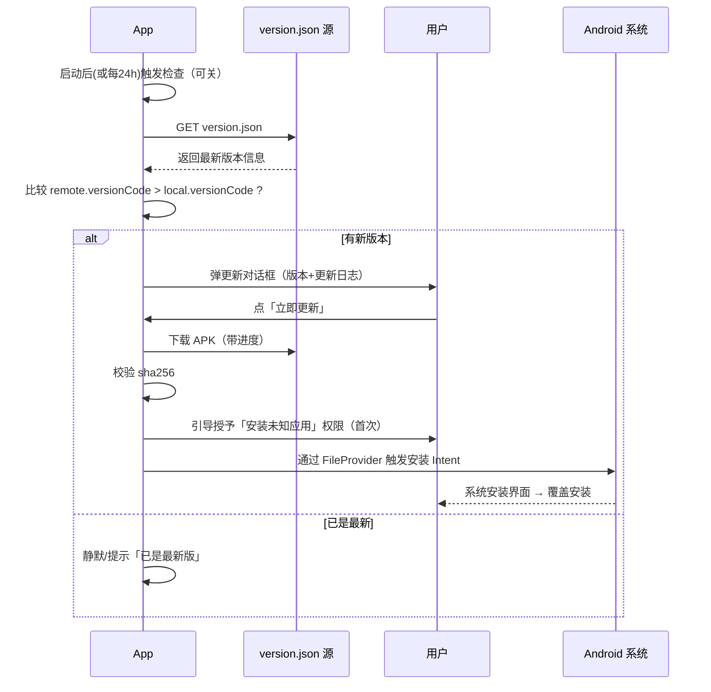

# 06 · 自动更新方案（Android）

> 个人使用、不上架应用商店，因此采用「App 内自检测 + 下载 APK + 触发安装」的自更新方案。

## 1. 方案选型

| 方案 | 是否适用 | 说明 |
| --- | --- | --- |
| Play Store In-App Update | ❌ | 需上架 Google Play，个人 sideload 不适用 |
| **自托管 version.json + APK** | ✅ 推荐 | 完全自控、零商店依赖、实现简单 |
| GitHub / Gitee Releases | ✅ 可选 | 用 Releases 当 APK 托管 + 版本来源，免服务器 |

**推荐**：一个静态可访问的 `version.json`（描述最新版本）+ APK 文件。托管位置任选其一：
- 自己的服务器 / 对象存储（七牛、阿里 OSS、Cloudflare R2…）
- **GitHub Releases**（最省事，免费、稳定）：上传 APK 为 release asset，`version.json` 也作为 asset 或用 raw 文件。
- Gitee Releases（国内访问更快）。

## 2. 版本号规范

- `versionName`：语义化版本 `MAJOR.MINOR.PATCH`，如 `1.2.0`，用于展示与比较。
- `versionCode`：单调递增整数，如 `12`，是**比较是否需要更新的权威依据**。
- 二者在 `pubspec.yaml` 的 `version: 1.2.0+12` 同时维护（`+` 后为 versionCode）。

## 3. version.json 协议

```json
{
  "versionName": "1.2.0",
  "versionCode": 12,
  "minSupportedVersionCode": 5,
  "apkUrl": "https://your-host/releases/foodlog-1.2.0.apk",
  "fileSize": 28311552,
  "sha256": "<apk 文件的 sha256>",
  "forceUpdate": false,
  "changelog": "- 新增做菜记录评分\n- 修复导入合并问题",
  "publishedAt": "2026-06-26T12:00:00Z"
}
```

字段说明：
- `versionCode`：> 本机 versionCode 即提示更新。
- `minSupportedVersionCode`：低于此值视为「必须更新」（如旧版备份格式不兼容）。
- `sha256`：下载后校验 APK 完整性，防止损坏/被篡改。
- `forceUpdate`：强制更新（罕用，仅破坏性变更时）。

## 4. 更新检查与安装流程



### 关键点
- **签名一致**：所有版本用同一个 keystore 签名，否则覆盖安装失败。务必妥善保存 keystore 与密码。
- **检查时机**：App 启动后延迟检查（不阻塞首屏）+ 设置里手动检查；记录 `last_update_check_at`，限制频率（如每 24h）。
- **可关闭**：设置项 `update_check_enabled`，尊重用户。
- **失败降级**：网络失败/源不可达 → 静默忽略，不打扰；手动检查时才提示失败。
- **强制更新**：仅当 `forceUpdate==true` 或当前版本 < `minSupportedVersionCode` 时，对话框不可取消。

## 5. Android 安装实现要点

### 权限（AndroidManifest.xml）
```xml
<uses-permission android:name="android.permission.INTERNET"/>
<uses-permission android:name="android.permission.REQUEST_INSTALL_PACKAGES"/>
```

### FileProvider（安装本地 APK 必需）
```xml
<provider
    android:name="androidx.core.content.FileProvider"
    android:authorities="${applicationId}.fileprovider"
    android:exported="false"
    android:grantUriPermissions="true">
    <meta-data
        android:name="android.support.FILE_PROVIDER_PATHS"
        android:resource="@xml/file_paths"/>
</provider>
```
`res/xml/file_paths.xml` 配置缓存目录路径。

### Dart 侧实现（伪代码）
```dart
// update_service.dart（抽象 + Android 实现）
abstract class UpdateService {
  Future<UpdateInfo?> check();                 // 返回有更新则非空
  Stream<double> download(UpdateInfo info);    // 下载进度 0..1
  Future<void> install(File apk);              // 触发安装
}

class AndroidUpdateService implements UpdateService {
  // 1. dio.get(versionJsonUrl) -> 解析 UpdateInfo
  // 2. 比较 versionCode（package_info_plus 读取本机）
  // 3. dio.download(apkUrl, tempPath, onReceiveProgress)
  // 4. 校验 sha256 == info.sha256
  // 5. 申请 canRequestPackageInstalls（permission_handler）
  // 6. OpenFilex.open(apkPath)  // 触发系统安装
}
```

> `open_filex` 打开 `.apk` 即唤起系统安装器；权限用 `permission_handler` 的 `Permission.requestInstallPackages`。

## 6. 跨平台占位（未来 iOS / 其它）

- `UpdateService` 为接口；iOS 不允许自更新 APK 式安装：
  - iOS 实现可改为「检测到新版本 → 跳转 TestFlight / 下载页」。
  - PWA / Web 天然由浏览器/Service Worker 更新，实现为 no-op 或刷新提示。
- 通过 `Platform.isAndroid` 在工厂里选择实现，保持上层调用一致。

## 7. 发布流程（每次出新版）

1. 改 `pubspec.yaml` 的 `version: x.y.z+code`（code 必须 +1）。
2. `flutter build apk --release`（或 `--split-per-abi` 减小体积），用固定 keystore 签名。
3. 计算 APK 的 sha256 与文件大小。
4. 上传 APK 到托管位置（如 GitHub Releases）。
5. 更新 `version.json`（versionName/Code/apkUrl/sha256/changelog）并发布到固定 URL。
6. 旧版本 App 下次检查即可收到更新。

> 可用脚本/CI（GitHub Actions）自动完成 3–5 步：构建 → 计算校验和 → 生成 version.json → 创建 Release。

## 8. 安全注意

- 始终通过 **HTTPS** 拉取 `version.json` 与 APK。
- **校验 sha256** 防止下载损坏或中间人篡改。
- keystore、签名密码、托管凭据妥善保管，勿入库。
- 不在日志打印下载地址凭据。
